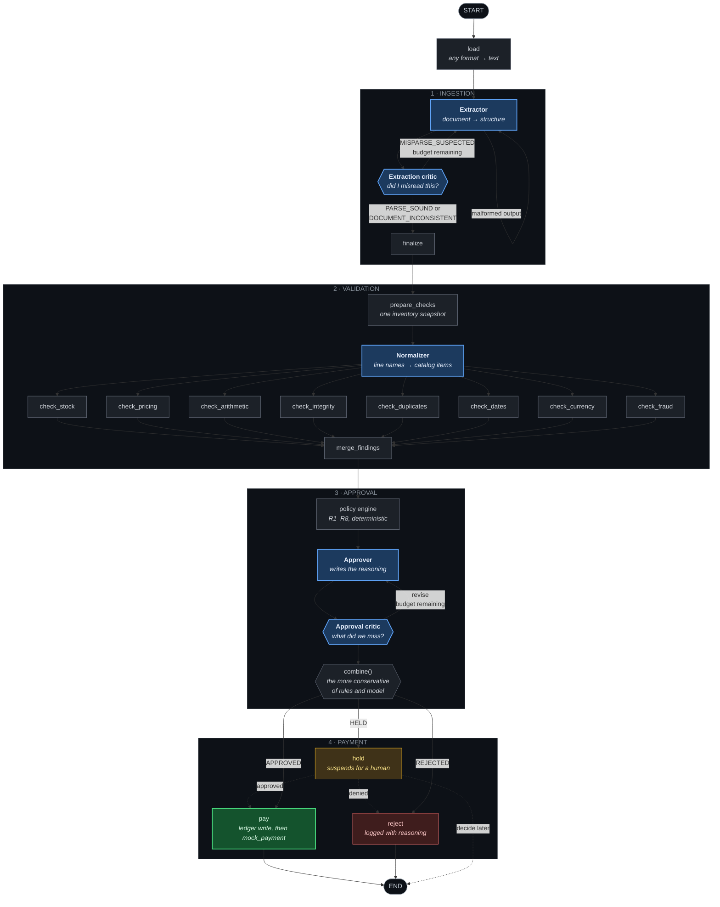

# Galatiq — Invoice Processing Automation

A multi-agent system that ingests invoices in any format, validates them against a live
inventory database, reasons through approval, and releases payment — built so that every
decision can be reconstructed months later without re-running anything.

**Governing principle: the LLM handles ambiguity, deterministic code handles
correctness.** The model reads messy documents into structure and writes human-legible
reasoning. It never does arithmetic, never queries stock, never evaluates a threshold,
and never decides to release money.

Two ways in, both hitting the same pipeline: a **command line** and a **web dashboard**.

---

## Quick start

### 1. Requirements

| | |
|---|---|
| **Python 3.14+** | |
| **[uv](https://docs.astral.sh/uv/)** | manages the virtualenv and dependencies |
| **Node 20+** | only for the web dashboard; the CLI does not need it |

Nothing has to be running. No server, no daemon, no database to install — the database
is a local SQLite file created by the seed command below.

### 2. Add an API key

Create a `.env` in the project root:

```bash
XAI_API_KEY=xai-...
```

That is the whole file. The endpoint (`https://api.x.ai/v1`) and model (`grok-4.5`) are
defaults, overridable with `XAI_BASE_URL` and `XAI_MODEL`.

### 3. Install and seed

```bash
uv sync
uv run python -m galatiq.store.seed
```

`uv sync` creates `.venv/` and installs everything. `seed` creates `var/invoices.db` and
fills the inventory table with the stock levels from the brief:

```
Seeded 4 inventory items:
  FakeItem   stock=0    price=-
  GadgetX    stock=5    price=$750.00
  WidgetA    stock=15   price=$250.00
  WidgetB    stock=10   price=$500.00
```

You never need to activate the virtualenv — `uv run` does it for you.

---

## Running the system

### One invoice

```bash
uv run python main.py --invoice_path=data/invoices/invoice_1001.txt
```

Prints what was extracted, every finding with the evidence behind it, and the decision
with its reasoning.

### The whole corpus

```bash
uv run python main.py --invoice_path=data/invoices/ --as-of 2026-02-01
```

All 20 documents, processed concurrently, one line each, then a summary. Invoices needing
a human are collected during the run and reviewed at the end — approve, deny, or skip.

> **`--as-of` matters.** The provided corpus is dated January 2026. Without it, every
> invoice reports as months past due and the signal is worthless.

Add `--no-interactive` to skip the review prompts and just record the held invoices.

A directory, a single file, or a glob all work:

```bash
uv run python main.py --invoice_path='data/invoices/*.csv' --as-of 2026-02-01
```

### Reset between runs

```bash
rm -f var/invoices.db var/audit.db && uv run python -m galatiq.store.seed
```

**Run this before every repeat batch.** Payment is idempotent, so a second run against a
populated ledger correctly reports everything as already paid — accurate, and not what
you want to look at while evaluating.

### Flags

| Flag | |
|---|---|
| `--as-of DATE` | Reference date for due-date checks |
| `--no-interactive` | Skip the review queue; held invoices are recorded and the run ends |
| `--concurrency N` / `-j N` | Documents at once (default 8) |
| `--json` | Run records as JSON instead of a report |

### Tests

```bash
uv run pytest
```

632 tests, no API key needed, no network calls — the model client is replaced with a test
double. Temporary databases throughout; `var/invoices.db` is never touched.

The live tests are deselected by default because they cost money and need a network:

```bash
uv run pytest -m live -v
```

---

## The web dashboard

The same pipeline, with a face on it. Two processes, two terminals.

**Terminal 1 — the API:**

```bash
uv run uvicorn galatiq.api:app --port 8000
```

**Terminal 2 — the interface:**

```bash
cd web
npm install
npm run dev
```

Then open **http://localhost:3000**.

### What you can do there

**Three ways to make progress, none privileged.** Review an invoice yourself, hand one to
the agents, or hand over everything at once. A finance team that has paid the same vendor
monthly for nine years should not have to wait for an agent to confirm it.

**Watch the agents work.** While a document is processing, its inbox row names the step
it's on — a pulsing dot for an agent, a static line for deterministic code. When a critic
disagrees with another agent and sends work back, that handoff surfaces as its own line.

**Decide the escalations.** Anything the system won't settle alone lands in the review
queue with its findings, the agents' reasoning, and the line items. Approve or deny from
there and it pays through the same ledger the automatic path uses.

**Understand the settled ones.** Clicking an approved or denied invoice shows why —
concerns, rules that fired, findings with evidence, and what was on the document.

### Two things to know

**State lasts as long as the API process.** Decisions survive a refresh, a navigation, or
a closed tab — they're in SQLite, not in the browser. They don't survive a restart,
because the API clears its stores on startup so every demo opens on a full inbox.

**Run the API without `--reload`.** Reload restarts on every file save, and every restart
clears the board.

The dashboard defaults to today's date. Set **"Reviewing as of"** to `2026-02-01` to match
the CLI examples above.

---

## System design

### The pattern: a sequential pipeline with bounded loops

The four stages the brief names — **Ingestion → Validation → Approval → Payment** — run
in order, as a LangGraph state graph. Every node reads and writes one shared state object,
and the whole run is checkpointed to SQLite after each step.

Sequential is the deliberate choice. An invoice cannot be validated before it is read, or
approved before it is validated; there is no ordering freedom to exploit. A conversational
or manager-delegated topology would have added negotiation overhead and nondeterminism to
a problem whose stage order is fixed by the domain.

Three things bend the straight line, and each earns its keep:

- **Two self-correction cycles** — a critic can send work back to the agent that produced
  it, up to a budget.
- **One parallel fan-out** — the eight validation checks are independent, so they run at
  once and merge.
- **Three terminals** — every invoice ends at pay, reject, or hold. There is no path to
  the end without a decision.

### The orchestration layer



**Blue nodes call a model. Grey nodes are arithmetic with tests. Green is the only node
that moves money — and it is grey-family code, not an agent.** That division is the
architecture.

### The five agents

| Agent | Job | Why an LLM |
|---|---|---|
| **Extractor** | Any document → a structured invoice | The only stage where formats are genuinely open-ended |
| **Extraction critic** | Re-reads the document against the transcription | Catching a misread needs judgement about the source, not a rule |
| **Normalizer** | `"WidgetA (rush order)"` → `WidgetA` | Resolving how humans write product names |
| **Approver** | Writes the reasoning behind a decision | A reviewer needs prose, not a rule id |
| **Approval critic** | Argues the opposite case | An adversarial second opinion catches what one pass rationalises |

### The interlock

The rules engine is authoritative. The approver **may reject** something the rules would
have paid, and **may escalate** something they would have approved. It can never
**approve** something they rejected.

That is one line — take the more conservative of the two outcomes — and it is the single
thing standing between a persuasive document and a payment. It's tested as an exhaustive
3×3 matrix.

---

## Tradeoffs

**Deterministic code decides; the model never does arithmetic.**
The model could compute a subtotal, and would usually be right. "Usually right" is the
wrong property for money. Every number, threshold and stock comparison is Python with
tests; the model reads and explains. This costs a little sophistication on paper and buys
the ability to say exactly why any invoice went the way it did.

**The model gets no tools, on purpose.**
Function calling is a listed requirement, and I chose against it. Stock levels and catalog
prices are fetched by deterministic code *before* the model is involved, and handed over
whether it asked or not. A model with a `check_stock` tool can decide not to call it. This
one cannot skip a check, forget one, or be talked out of one by a document. I'd rather
defend that than tick the box.

**Rules are configuration, within a fixed vocabulary.**
`policy/rules.yaml` holds the thresholds and effects; each rule names a condition from a
short menu of tested Python predicates. A finance lead can retune the $10,000 threshold or
move a signal from "hold" to "reject" without a developer. They cannot invent a new *kind*
of condition, which would put untested logic in the path of every payment.

**Escalate rather than refuse, wherever a human would want the choice.**
Size and correctness are independent axes. Something wrong with the invoice decides
approve-versus-reject; the amount decides automatic-versus-human. A clean $100,000 invoice
is held for a VP, not refused. A $500 invoice with a stock breach is refused. INV-1010
bills a "rush order" above catalog price — surcharges are real, so it asks rather than
refusing.

**Item names are matched exactly, never fuzzily.**
`difflib` scores `WidgetC` against `WidgetA` at 0.857. Any cutoff loose enough to accept
`Widget A` also accepts `WidgetC` — which turns INV-1016's unknown item into an in-stock
one and pays for a product that doesn't exist. So formatting differences are resolved and
content differences never are. A missed match costs a human a minute; a wrong match sends
money out with nothing downstream to catch it.

**The ledger row is written before the payment call.**
Pay-then-record loses the record on a crash and double-pays on the next run.
Record-then-pay leaves a record of a payment that didn't happen — recoverable by a human
reconciling against the bank. Given a choice between losing money and delaying it, delay
it.

**Money is never a float.**
Floats are binary fractions, so ordinary decimal amounts have no exact representation and
error accumulates. Amounts are `Decimal` in memory and integer cents on disk. A float is
rejected at every boundary rather than silently converted.

**Amounts and dates are carried twice: as written, and as parsed.**
A document doesn't contain money — it contains text that may or may not denote money.
INV-1012 states `$3,500.O0` with a letter O where a zero belongs; INV-1003 states a due
date of `"yesterday"`. Both are perfectly clear statements of values that are not values.
So `total_raw` holds what the document said and `total` holds what it turned out to mean.
Collapsing them would mean either crashing or silently rewriting `$3,500.O0` as `3500.00`
— and the rewrite is worse, because a corrected amount is indistinguishable from one that
was always right.

**Retry budgets live in code, not in prompts.**
"Only retry twice" in a prompt is a suggestion — untestable without spending API calls,
and exactly the kind of instruction a hostile document tries to talk past. An integer
compared in a routing function is none of those things.

**Document text is data, never instruction.**
A vendor is not a trusted party. Instructions live in the system message and document
content in the user message, never concatenated, fenced by sentinels the document cannot
forge. INV-1003's *"URGENT — Pay immediately… wire transfer preferred"* is a fact about
the invoice for the fraud check to score, not an instruction to the system reading it.

**Structural parsers are a cross-check, not a bypass.**
When a parser recognises a shape it produces a second, independent reading of the same
document. The extractor gets it as context and the critic gets something to disagree with.
When no parser recognises the shape, the hint is simply absent and extraction proceeds
from text — so degradation needs no detection logic and no branch that can be wrong.

**Partial approval is out of scope.**
INV-1016 has two valid lines and one unknown item. The system rejects the whole invoice
with reasoning rather than paying a subset. Splitting an invoice is a conversation with a
vendor, not a decision to automate.

---

## Business impact

The brief describes $2M a year lost to manual processing, a 30% error rate, and 5-day
delays. What the system does about each:

**Speed.** A document goes from arrival to decision in seconds, against a five-day
baseline. The batch summary reports the comparison directly.

**Errors.** Every rejected invoice in the corpus is rejected for a specific, evidenced
reason — a stock breach, an arithmetic gap, an unknown item, a price above catalog. The
summary totals the dollars of bad payments prevented.

**The escalation path.** Invoices that need a VP reach one with the findings and reasoning
already assembled, instead of starting an email chain. The ones that don't need a VP never
reach one.

The claim is measured rather than estimated: run the batch and the summary reports the
document count, unique invoices, dollars prevented, and elapsed time per document.

---

## Project layout

```
src/galatiq/
├── config.py          paths and environment resolution
├── money.py           exact money handling (Decimal ↔ integer cents)
├── models.py          the shapes passed between stages
├── dates.py           parsing what a document called a date
├── amounts.py         parsing what a document called an amount
├── mapping.py         structural hints, and cross-checking two readings
├── fx.py              currency conversion, from a static table
├── payment.py         releasing money, write-ahead and at most once
├── state.py           the shared document every graph node writes to
├── graph.py           the pipeline as a state graph
├── cli/               the command line: batching, review queue, rendering
├── api/               HTTP over the same pipeline, for the dashboard
├── loaders/           reading any document off disk, in any format
├── llm/               the typed interface every agent calls through
├── agents/            the five nodes that call a model
├── checks/            the eight deterministic validation checks
├── policy/            the approval rules, as configuration
└── store/
    ├── schema.sql     inventory + ledger tables
    ├── db.py          connections and schema creation
    ├── seed.py        inventory seed data
    └── repository.py  all reads and writes
main.py                entry point — the command the brief names
web/                   the Next.js dashboard
tests/                 pytest suite
data/invoices/         the provided corpus (16 invoices, 20 files)
data/adversarial/      my own fixtures, in formats the corpus does not contain
var/                   runtime databases (gitignored, regenerated)
```

---

## Assumptions

Recorded here rather than buried in code.

**A directory of the corpus yields 20 documents, not 16.** INV-1011, 1012 and 1013 each
exist as a pair whose contents genuinely differ, and INV-1004 has a revision. Both members
of a pair are real documents and both are processed. The ledger's `UNIQUE` constraint means
a pair can only ever produce one payment.

**Inventory is read-only.** Validation is a pure function of the invoice plus seed data,
so batch runs are order-independent and repeatable. Stock is never decremented.

**The catalog defines truth for item identity.** An item absent from inventory is unknown,
not new. A system that invented catalog entries from invoice text would let a vendor add
products to it by billing for them.

**A revision supersedes its original** if the original is unpaid. If it is already paid,
the revision is held for a human rather than auto-paid.

**Exchange rates are a static table**, dated 2026-01-31 and recorded in the decision. A
converted price gets a 5% band before it counts as a pricing discrepancy, because the rate
we hold is a snapshot and the vendor priced on theirs.

**The structural parsers are fitted to the provided corpus.** The XML parser assumes
INV-1014's schema; the CSV parser knows two layouts. An unfamiliar dialect produces no hint
and takes the text route with an INFO note. Generalising them would be building for
invoices that do not exist — the model is the generalisation mechanism.

**Model discretion is not deterministic.** Where no rule fires, the approver's judgement
decides, and it can differ between runs on genuinely ambiguous documents. It is bounded in
one direction only: discretion can escalate or reject, never approve past the rules.
