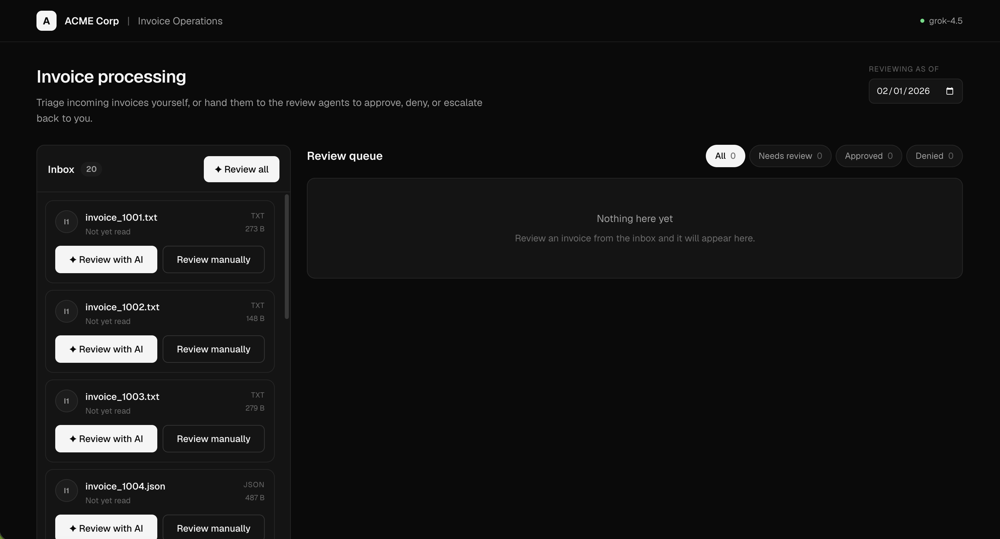
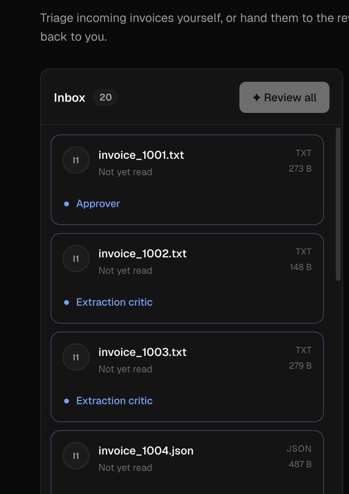
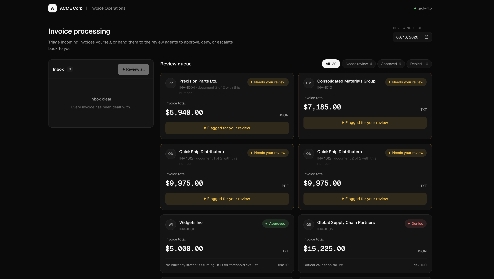
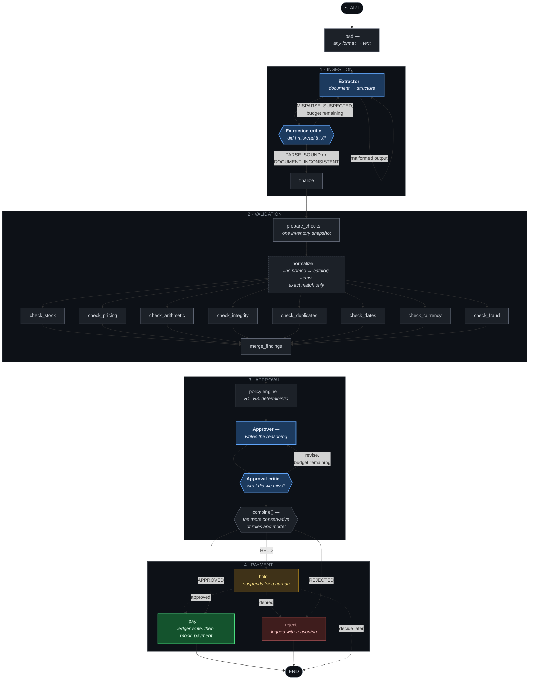

# Galatiq — Invoice Processing Automation

A multi-agent system that ingests invoices in any format, validates them against a live
inventory database, reasons through approval, and releases payment — built so that every
decision can be reconstructed months later without re-running anything.

**Governing principle: the LLM handles ambiguity, deterministic code handles
correctness.** The model reads messy documents into structure and writes human-legible
reasoning. It never does arithmetic, never queries stock, never evaluates a threshold, and
never decides to release money.

There are two ways in, both running the same pipeline: a **command line** and a **web
dashboard**.

---

## Quick start

### 1. Requirements

| | |
|---|---|
| **Python 3.14+** | |
| **[uv](https://docs.astral.sh/uv/)** | manages the virtualenv and dependencies |
| **Node 20+** | only for the web dashboard; the CLI does not need it |

Nothing has to be running. No server, no daemon, no database to install — the database
is a local SQLite file created by the seed command below.

### 2. Add an API key

Copy `.env.example` to `.env` in the project root and fill in the key:

```bash
cp .env.example .env
```

```bash
XAI_API_KEY=xai-...
```

That is the whole file. The endpoint (`https://api.x.ai/v1`) and model (`grok-4.5`) are
defaults, overridable with `XAI_BASE_URL` and `XAI_MODEL`.

### 3. Install and seed

```bash
uv sync
uv run python -m galatiq.store.seed
```

`uv sync` creates `.venv/` and installs everything. `seed` creates `var/invoices.db` and
fills the inventory table with the stock levels from the brief:

```
Seeded 4 inventory items:
  FakeItem   stock=0    price=-
  GadgetX    stock=5    price=$750.00
  WidgetA    stock=15   price=$250.00
  WidgetB    stock=10   price=$500.00
```

You never need to activate the virtualenv — `uv run` does it for you.

---

## Running the system

### One invoice

```bash
uv run python main.py --invoice_path=data/invoices/invoice_1001.txt
```

Prints what was extracted, every finding with the evidence behind it, and the decision
with its reasoning.

### The whole corpus

```bash
uv run python main.py --invoice_path=data/invoices/ --as-of 2026-02-01
```

All 20 documents, processed concurrently, one line each, then a summary. Invoices needing
a human are collected during the run and reviewed at the end — approve, deny, or skip.

> **`--as-of` matters.** The provided corpus is dated January 2026. Without it, due-date
> checks run against today and every invoice reports as months overdue, so that signal
> tells you nothing.

Add `--no-interactive` to skip the review prompts and just record the held invoices.

A directory, a single file, or a glob all work:

```bash
uv run python main.py --invoice_path='data/invoices/*.csv' --as-of 2026-02-01
```

### Reset between runs

```bash
rm -f var/invoices.db var/audit.db && uv run python -m galatiq.store.seed
```

**Run this before every repeat batch.** Payment is idempotent, so a second run against a
populated ledger correctly reports everything as already paid. That is the right answer,
but it makes for a dull second look at the system.

### Watching it work

```bash
uv run python main.py --invoice_path=data/invoices/ --as-of 2026-02-01 --verbose
```

`--verbose` prints every step as it happens. `~` marks a node that calls a model, `-`
marks deterministic code:

```
  - invoice_1013.json          Reading the document
  ~ invoice_1013.json          Extractor
  ~ invoice_1013.json          Extraction critic
  <- invoice_1013.json         Extraction critic -> Extractor: subtotal: read
                               21400.00, document says 21040.00
  ~ invoice_1013.json          Extractor
  - invoice_1013.json          Running 8 checks at once
  ~ invoice_1013.json          Approver
  ~ invoice_1013.json          Approval critic
```

The yellow `<-` line is a **self-correction loop firing** — one agent telling another it
misread the document, with the specific disagreement. Under concurrency the filename
column keeps eight documents legible at once.

### Logs

Every run writes `var/galatiq.log`, whether or not you ask for it:

```
2026-02-01 09:14:22,104 INFO  galatiq.cli.runner   batch start  20 document(s)  concurrency=8  as_of=2026-02-01
2026-02-01 09:14:31,882 DEBUG galatiq.llm.xai      grok-4.5 call ok  Invoice  2841ms  prompt=1204 completion=386
2026-02-01 09:14:44,019 INFO  galatiq.payment      payment  INV-1001  5000.00 USD to Widgets Inc.  (xai/grok-4.5)
2026-02-01 09:14:44,021 INFO  galatiq.cli.runner   done    invoice_1001.txt  INV-1001  APPROVED  21917ms
2026-02-01 09:17:58,332 INFO  galatiq.cli.runner   batch end    20 document(s) in 221.2s  APPROVED=6  HELD_FOR_REVIEW=4  REJECTED=10
```

Token counts per call, latency per document, every payment, and full tracebacks for
anything that failed. Transport retries log at WARNING so they surface without
`--verbose` — otherwise a run that quietly retried thirty times looks identical to one
that went through cleanly.

**This is deliberately not the audit trail.** Why an invoice was decided a certain way
lives in the checkpointer and the `runs` table, where it is durable and queryable. The log
answers a different question: what the *run* was doing. Keeping decisions in one place
avoids a second copy that can drift out of sync with the first.

The API logs the same way, to the terminal running it.

### Flags

| Flag | |
|---|---|
| `--as-of DATE` | Reference date for due-date checks |
| `--verbose` / `-v` | Show each agent and check as it runs |
| `--no-interactive` | Skip the review queue; held invoices are recorded and the run ends |
| `--concurrency N` / `-j N` | Documents at once (default 8) |
| `--json` | Run records as JSON instead of a report |

### Tests

```bash
uv run pytest
```

645 tests, no API key needed, no network calls — the model client is replaced with a test
double. Temporary databases throughout; `var/invoices.db` is never touched.

The live tests are deselected by default because they cost money and need a network:

```bash
uv run pytest -m live -v
```

---

## The web dashboard

The same pipeline with an interface on top of it. Two processes, two terminals.

**Terminal 1 — the API:**

```bash
uv run uvicorn galatiq.api:app --port 8000
```

**Terminal 2 — the interface:**

```bash
cd web
npm install
npm run dev
```

Then open **http://localhost:3000**.

### What it looks like



*A fresh start. Twenty documents in the inbox, each one reviewable either way, and an
empty queue on the right.*



*Mid-run. Each row names the step it is on — one document with the approver, two with the
extraction critic.*



*After a batch. Inbox clear, every document settled as approved, denied, or flagged for a
human — with the reasoning behind each one a click away.*

### What you can do there

**Three ways to make progress, none of them privileged.** Review an invoice yourself, hand
one to the agents, or hand over the whole inbox at once. A finance team that has paid the
same vendor monthly for nine years shouldn't have to wait on an agent to confirm it.

**Watch the agents work.** While a document is processing, its inbox row names the step
it's on — a pulsing dot for an agent, a static line for deterministic code. When a critic
disagrees with another agent and sends work back, that handoff surfaces as its own line.

**Decide the escalations.** Anything the system won't settle alone lands in the review
queue with its findings, the agents' reasoning, and the line items. Approve or deny from
there and it pays through the same ledger the automatic path uses.

**Understand the settled ones.** Clicking an approved or denied invoice shows why —
concerns, rules that fired, findings with evidence, and what was on the document.

### Two things to know

**State lasts as long as the API process.** Decisions survive a refresh, a navigation, or
a closed tab — they're in SQLite, not in the browser. They don't survive a restart,
because the API clears its stores on startup so every demo opens on a full inbox.

**Run the API without `--reload`.** Reload restarts on every file save, and every restart
clears the board.

The dashboard defaults to today's date. Set **"Reviewing as of"** to `2026-02-01` to match
the CLI examples above.

---

## System design

### The pattern: a sequential pipeline with bounded loops

The four stages the brief names — **Ingestion → Validation → Approval → Payment** — run
in order, as a LangGraph state graph. Every node reads and writes one shared state object,
and the whole run is checkpointed to SQLite after each step.

Sequential is a deliberate choice. An invoice cannot be validated before it is read, or
approved before it is validated, so there is no ordering freedom to exploit. The
alternatives — a conversational group of agents, or a manager delegating to workers —
would add coordination overhead and run-to-run variability to a problem whose stage order
is already fixed by the domain.

Three things bend the straight line, and each earns its keep:

- **Two self-correction cycles** — a critic can send work back to the agent that produced
  it, up to a fixed retry budget.
- **One parallel fan-out** — the eight validation checks don't depend on each other, so
  they run at once and their findings merge.
- **Three terminals** — every invoice ends at pay, reject, or hold. There is no path to
  the end that skips a decision.

### The orchestration layer



**Blue nodes are agents. Grey nodes are tested Python. Green is the only node that moves
money — and it is deterministic code, not an agent.** That division is the architecture.
The dashed node is `normalize`: deterministic matching with a model fallback, below.

### The four agents

| Agent | Job | Why an LLM |
|---|---|---|
| **Extractor** | Any document → a structured invoice | The only stage where formats are genuinely open-ended |
| **Extraction critic** | Re-reads the document against the transcription | Catching a misread takes judgement about the source, not a rule |
| **Approver** | Writes the reasoning behind a decision | A reviewer needs an explanation, not a rule id |
| **Approval critic** | Argues the opposite case | A second, adversarial pass catches what a single pass talks itself into |

`normalize` is not one of them. Turning `"WidgetA (rush order)"` into `WidgetA` is a
lookup, not a judgement: strip qualifiers, punctuation and spacing, then require an exact
match on the catalog. Leftovers get one model call per invoice, and an answer naming
anything not in the catalog is discarded — no loop, no critic, no say in any outcome.

### The interlock

The rules engine is authoritative, and the model's judgement can only ever move a decision
in the safer direction. The approver **may reject** something the rules would have paid,
and **may escalate** something they would have approved. It can never **approve**
something they rejected.

That is one function — take the more conservative of the two outcomes — and it is the
single thing standing between a persuasive document and a payment, so it is tested as an
exhaustive 3×3 matrix of rule outcome against model outcome.

---

## Tradeoffs

Most of these come back to the same question. When one option is more capable and the
other is more predictable, which one belongs in the path of a payment? The answers below
consistently favour predictability, and each one names what that cost.

**The model call is the one thing that leaves the machine.**
The brief asks for Grok *and* for no internet; both can't hold, so I took the live API
because the reasoning is the part worth judging. Everything else runs locally as scoped —
database, ledger, mock payment, audit trail, dashboard — and the tests need no key and no
network.

**The model reads and explains; code decides.**
The model could compute a subtotal or compare a stock level, and would usually get it
right. "Usually right" is the wrong property for money. Every number, threshold and stock
comparison is Python with tests, and the model's job is to turn a document into structure
and a decision into prose. This gives up some apparent sophistication and buys the ability
to say exactly why any given invoice went the way it did.

**The model gets no tools, on purpose.**
Function calling is a listed requirement, but I chose against it. Stock levels and catalog
prices are fetched by deterministic code *before* the model is involved and handed to it
whether it asked or not. The reason is that a tool is optional by construction: a model
holding a `check_stock` tool can decide not to call it, or be persuaded by a document that
it doesn't need to. Supplying the data up front means no check can be skipped, forgotten,
or argued away. The cost is a less flexible agent, which is the right thing to give up
here.

**Rules are configuration, within a fixed vocabulary.**
`policy/rules.yaml` holds the thresholds and their effects, and each rule selects its
condition from a short menu of tested Python predicates. A finance lead can retune the
$10,000 approval threshold or move a signal from "hold" to "reject" without a developer,
but cannot invent a new *kind* of condition — that would put untested logic in the path of
every payment. It's a deliberate ceiling on how far configuration can go.

**Escalate rather than refuse, wherever a human would want the choice.**
Size and correctness are treated as independent axes: something being wrong with the
invoice decides approve-versus-reject, while the amount decides automatic-versus-human. So
a clean $100,000 invoice is held for a VP rather than refused, and a $500 invoice with a
stock breach is refused outright. INV-1010 bills a "rush order" above catalog price;
surcharges are legitimate often enough that the system asks instead of refusing.

**Item names are matched exactly, never fuzzily.**
Fuzzy matching is the obvious way to handle vendors writing `Widget A` for `WidgetA`, but
the catalog makes it unsafe: similarity scoring puts `WidgetC` and `WidgetA` at 0.857, so
any threshold loose enough to accept the harmless spacing difference also accepts a
genuinely different product. In INV-1016 that would turn an unknown item into an in-stock
one and pay for a product that doesn't exist. The system therefore resolves formatting
differences and never content differences. A missed match costs a human a minute; a wrong
match sends money out with nothing downstream to catch it.

**The ledger row is written before the payment call.**
Neither order is safe under a crash, so this is a choice about which failure to prefer.
Paying first loses the record if the process dies mid-call, and the next run pays again.
Recording first can leave a record of a payment that never happened, which a human catches
when reconciling against the bank. Between losing money and delaying it, delay it.

**Money is never a float.**
Floats are binary fractions, so ordinary decimal amounts like $0.10 have no exact
representation and the error compounds across line items. Amounts are `Decimal` in memory
and integer cents on disk, and a float is rejected at every boundary rather than quietly
converted.

**Amounts and dates are carried twice: as written, and as parsed.**
A document doesn't contain money, it contains text that may or may not denote money.
INV-1012 states `$3,500.O0`, with a letter O where a zero belongs; INV-1003 gives a due
date of `"yesterday"`. Both are clear statements of things that are not yet values. So
`total_raw` holds what the document said and `total` holds what it turned out to mean.
Collapsing the two would mean either rejecting the document outright or silently rewriting
`$3,500.O0` as `3500.00` — and the rewrite is the worse option, because a corrected amount
then looks identical to one that was right all along.

**Retry budgets live in code, not in prompts.**
Telling a model "only retry twice" is a request, not a limit: it can't be tested without
spending API calls, and it's exactly the kind of instruction a hostile document tries to
talk past. An integer compared in a routing function has neither problem.

**Document text is data, never instruction.**
A vendor is not a trusted party, so nothing in a document is allowed to reach the model as
a directive. Instructions stay in the system message and document content in the user
message, never concatenated, fenced by sentinels the document cannot forge. INV-1003's
*"URGENT — Pay immediately… wire transfer preferred"* is a fact about the invoice for the
fraud check to score, not an instruction to the system reading it.

**Structural parsers are a cross-check, not a bypass.**
Several formats in the corpus could be parsed directly, but a parser that owns extraction
becomes a second code path with its own failure modes. Instead, when a parser recognises a
shape it produces an independent second reading: the extractor sees it as context, and the
critic gets something concrete to disagree with. When no parser recognises the shape, the
hint is simply absent and extraction proceeds from text — degradation needs no detection
logic and no branch that could be wrong.

**Partial approval is out of scope.**
INV-1016 has two valid lines and one unknown item. The system rejects the whole invoice
with reasoning rather than paying the good portion. Splitting an invoice is a conversation
with a vendor, not a decision to automate.

---

## Business impact

The brief describes $2M a year lost to manual processing, a 30% error rate, and 5-day
delays. What the system does about each:

**Speed.** A document goes from arrival to decision in seconds, against a five-day
baseline. The batch summary reports the comparison directly.

**Errors.** Every rejected invoice in the corpus is rejected for a specific, evidenced
reason — a stock breach, an arithmetic gap, an unknown item, a price above catalog. The
summary totals the dollars of bad payments prevented.

**The escalation path.** Invoices that need a VP reach one with the findings and reasoning
already assembled, instead of starting an email chain. The ones that don't need a VP never
reach one.

The claim is measured rather than estimated: run the batch and the summary reports the
document count, unique invoices, dollars prevented, and elapsed time per document.

---

## Assumptions

Judgement calls the brief left open, recorded here rather than left to be inferred from
the code.

**A directory of the corpus yields 20 documents, not 16.** INV-1011, 1012 and 1013 each
exist as a pair whose contents genuinely differ, and INV-1004 has a revision. Both members
of a pair are real documents and both are processed. The ledger's `UNIQUE` constraint means
a pair can only ever produce one payment.

**Inventory is read-only.** Validation is a pure function of the invoice plus seed data,
so batch runs are order-independent and repeatable. Stock is never decremented.

**The catalog defines truth for item identity.** An item absent from inventory is unknown,
not new. A system that invented catalog entries from invoice text would let a vendor add
products to it by billing for them.

**A revision supersedes its original** if the original is unpaid. If it is already paid,
the revision is held for a human rather than auto-paid.

**Exchange rates are a static table**, dated 2026-01-31 and recorded alongside the
decision. Converted prices get a 5% tolerance before they count as a pricing discrepancy,
since our rate is a snapshot and the vendor priced against theirs.

**The structural parsers are fitted to the provided corpus.** The XML parser assumes
INV-1014's schema; the CSV parser knows two layouts. An unfamiliar dialect produces no hint
and takes the text route with an INFO note. Generalising them would be building for
invoices that do not exist — the model is the generalisation mechanism.

**Model discretion is not deterministic.** Where no rule fires, the approver's judgement
decides, and it can differ between runs on genuinely ambiguous documents. It is bounded in
one direction only: discretion can escalate or reject, never approve past the rules.
